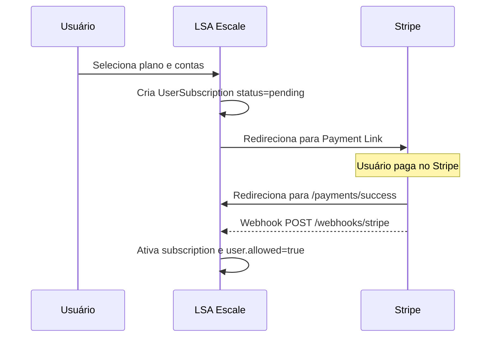

# Guia Completo: Configuração do Stripe para LSA Escale

## Visão Geral da Integração

Sua app está usando **Stripe Payment Links** para cobranças. O fluxo funciona assim:

---

## PASSO 1: Variáveis de Ambiente Necessárias

Sua app precisa de **2 variáveis de ambiente** configuradas no servidor de produção:

| Variável | Onde obter | Descrição |
|----------|-----------|-----------|
| `STRIPE_SECRET_KEY` | Stripe Dashboard > Developers > API Keys | Chave secreta da API |
| `STRIPE_WEBHOOK_SECRET` | Stripe Dashboard > Developers > Webhooks | Signing secret do webhook endpoint |

⚠️ **CRÍTICO**: Sem `STRIPE_WEBHOOK_SECRET`, os webhooks serão rejeitados e as assinaturas **nunca serão ativadas**.

---

## PASSO 2: Configurar Webhook no Stripe Dashboard

Este é o passo mais importante. Sem o webhook, o pagamento será processado mas a assinatura do usuário ficará eternamente como `pending`.

### Instruções passo a passo:

1. Acesse **[Stripe Dashboard > Developers > Webhooks](https://dashboard.stripe.com/webhooks)**
2. Clique em **"Add endpoint"**
3. Configure:
   - **Endpoint URL**: `https://www.lsaescale.com/webhooks/stripe`
   - **Description**: `LSA Escale - Subscription Management`
   - **Listen to**: Selecione **Events on your account**
4. Em **"Select events to listen to"**, adicione os seguintes eventos:

| Evento | Para que serve |
|--------|---------------|
| `checkout.session.completed` | **Essencial** - Ativa a assinatura após pagamento via Payment Link |
| `customer.subscription.updated` | Atualiza status quando assinatura muda no Stripe |
| `customer.subscription.deleted` | Cancela assinatura e revoga acesso |
| `invoice.payment_succeeded` | Confirma renovação mensal |
| `invoice.payment_failed` | Marca como `past_due` quando pagamento falha |

5. Clique em **"Add endpoint"**
6. Na página do endpoint criado, copie o **"Signing secret"** - ele começa com `whsec_`
7. Configure essa chave como variável de ambiente `STRIPE_WEBHOOK_SECRET` no seu servidor

---

## PASSO 3: Configurar os Payment Links no Stripe

Cada Payment Link precisa estar configurado para criar **Subscriptions** - não pagamentos únicos. Verifique no Stripe Dashboard:

1. Acesse **[Stripe Dashboard > Payment Links](https://dashboard.stripe.com/payment-links)**
2. Para cada um dos 5 links, verifique:
   - O produto/preço está configurado como **Recurring** - mensal
   - O link está **ativo**

### Payment Links cadastrados na sua app:

| Plano | Slug | Preço | Payment Link |
|-------|------|-------|--------------|
| 1 Sub-Account | `sub_1` | R$50/mês | `https://buy.stripe.com/28E14neP5emlaB8cUBgbm00` |
| 3 Sub-Accounts | `sub_3` | R$150/mês | `https://buy.stripe.com/aFa9ATgXd4LL5gO2fXgbm01` |
| 5 Sub-Accounts | `sub_5` | R$250/mês | `https://buy.stripe.com/4gM7sLeP54LL8t08Elgbm02` |
| 30-49 Sub-Accounts | `sub_30` | R$1.000/mês | `https://buy.stripe.com/28EaEXdL1cedgZwg6Ngbm03` |
| 50/Unlimited | `sub_unlimited` | R$1.500/mês | `https://buy.stripe.com/00wfZh22jgut10y1bTgbm04` |

### Como a identificação do usuário funciona:

Sua app adiciona parâmetros à URL do Payment Link automaticamente em `Plan#payment_link_url_for`:
- `client_reference_id` = ID do usuário no banco
- `prefilled_email` = email do usuário

O webhook usa o `client_reference_id` para encontrar o usuário e ativar a assinatura.

---

## PASSO 4: Configurar Customer Portal - opcional mas recomendado

Para que o botão "Gerenciar Assinatura" no `/billing` funcione:

1. Acesse **[Stripe Dashboard > Settings > Billing > Customer Portal](https://dashboard.stripe.com/settings/billing/portal)**
2. Ative as opções desejadas:
   - ✅ Permitir cancelamento de assinatura
   - ✅ Permitir atualização de método de pagamento
   - ✅ Mostrar histórico de faturas
3. Salve

---

## PASSO 5: Testar o Fluxo Completo

### Teste com cartão de teste do Stripe:

1. **Crie um usuário teste** na app
2. **Conecte uma conta Google Ads**
3. **Selecione um plano** - o sistema criará uma `UserSubscription` com status `pending`
4. **Complete o pagamento** no Stripe usando cartão de teste:
   - Cartão sucesso: `4242 4242 4242 4242`
   - Qualquer data futura, qualquer CVC
5. **Verifique**: Após o pagamento, o Stripe deve:
   - Redirecionar para `/payments/success`
   - Enviar webhook `checkout.session.completed`
   - A app ativa a subscription e seta `user.allowed = true`

### Como verificar que o webhook funcionou:

1. **No Stripe Dashboard**: Vá em Developers > Webhooks > clique no endpoint > aba "Attempts"
   - Deve mostrar status `200` para os eventos enviados
2. **No banco de dados**: Verifique se a `UserSubscription` mudou de `pending` para `active`
3. **Na app**: O usuário deve ter acesso ao dashboard/leads

### Teste de falha de pagamento:

- Cartão que será recusado: `4000 0000 0000 0002`
- Verifique que o webhook `invoice.payment_failed` chega e marca como `past_due`

### Teste de cancelamento:

1. No Stripe Dashboard, cancele a subscription manualmente
2. Verifique que o webhook `customer.subscription.deleted` chega
3. O `user.allowed` deve mudar para `false`

---

## Checklist de Verificação

- [ ] `STRIPE_SECRET_KEY` configurada no servidor de produção
- [ ] `STRIPE_WEBHOOK_SECRET` configurada no servidor de produção
- [ ] Webhook endpoint criado no Stripe apontando para `https://www.lsaescale.com/webhooks/stripe`
- [ ] 5 eventos selecionados no webhook: `checkout.session.completed`, `customer.subscription.updated`, `customer.subscription.deleted`, `invoice.payment_succeeded`, `invoice.payment_failed`
- [ ] Payment Links estão ativos e configurados como subscription mensal
- [ ] Customer Portal ativado no Stripe
- [ ] Teste completo com cartão de teste: pagamento → webhook → ativação
- [ ] Teste de webhook no Stripe Dashboard mostra status 200

---

## Troubleshooting

### Subscription fica como "pending" após pagamento
**Causa mais provável**: Webhook não está chegando ou está falhando.
- Verifique `STRIPE_WEBHOOK_SECRET` está correta
- Verifique nos logs do Stripe Dashboard se o webhook foi enviado
- Verifique nos logs do Rails: `[Webhook]` prefixo

### Webhook retorna 400
- `Invalid payload`: Problema com o body da request
- `Invalid signature`: `STRIPE_WEBHOOK_SECRET` está errada ou não está configurada

### Usuário não encontrado no webhook
O webhook tenta encontrar o usuário por:
1. `client_reference_id` da session - corresponde ao `user.id`
2. `customer_email` - corresponde ao `user.email`

Se nenhum funcionar, o log mostrará: `[Webhook] User not found`

### Payment Link redireciona mas não volta para a app
Os Payment Links do Stripe podem ser configurados com uma "after payment" URL. Verifique se os seus links têm uma configuração de redirecionamento para `https://www.lsaescale.com/payments/success`
